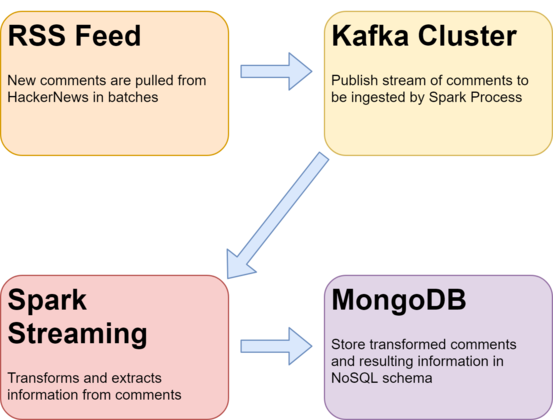

## Streaming HackerNews Comments with Pyspark and Kafka

This is an ETL project where I created a direct stream of HackerNews comments. For each comment, I decided to normalize and preprocess the comment, as well as extract entities. Data was then sent to  

<div style = 'text-align: center'></div>


Steps:

1. Start zookeeper server:

    ```
    C:\kafka\bin\windows> zookeeper-server-start.bat ../../config/zookeeper.properties
    ```

2. Start Kafka Server:

    ```
    C:\kafka\bin\windows> kafka-server-start.bat ../../config/server.properties
    ```

3. Create topic for storing HackerNews data:

    ```
    kafka-topics.bat --create --bootstrap-server localhost:9092 --replication-factor 1 --partitions 1 --topic hncomments
    ```

4. Create a MongoDB schema for storing transformed data:

    ```
    use hncommments
    db.createCollection("firstcollection")
    ```


4. Begin collecting HackerNews data with ```rssfeed.py```:

    ```
    spark\hackernewsETL> python rssfeed.py
    ```

    You should see something like this when ```rssfeed.py``` starts:

    ```
    Found 20 new entries after Fri, 01 Jan 2021 18:03:42 GMT.
    ```

    meaning that 20 new comments have been found. 


5. Begin streaming comments with ```kafkatopyspark.py```:

    To begin streaming, we need to submit our spark job with some specific dependencies and configurations. First, we need to use the ```spark-streaming-kafka``` package to enable streaming from our Kafka cluster. Next, we need to use ```mongo-spark-connector``` to allow a connection to be made to our MongoDB schema. Finally, we need to point the session to the correct MongoDB database and collection using ```--conf```. 
    ```
    spark\hackernewsETL> spark-submit \
    --packages org.apache.spark:spark-streaming-kafka-0-8_2.11:2.4.6,\
    org.mongodb.spark:mongo-spark-connector_2.11:2.4.2 \
    --conf spark.mongodb.output.uri=mongodb://127.0.0.1/test.mycollection kafkatopyspark.py
    ```

    As comments start to pour in, the Spark pipeline will normalize them and store them in the database. Here's what the output of a transformed batch looks like:

    ```
    +--------------------+-------------------+--------------------+
    |             comment|        date_posted|            entities|
    +--------------------+-------------------+--------------------+
    |i think thats bec...|2021-01-04 18:39:33|          [FTE, FTE]|
    |snowden is a spy ...|2021-01-04 18:39:30|           [Snowden]|
    |seems to be fine ...|2021-01-04 18:39:30|      [the Bay Area]|
    |that sounds like ...|2021-01-04 18:39:19|  [Bitcoin, Bitcoin]|
    |at least for the ...|2021-01-04 18:39:18|[Mac, OWA, 1, OWA...|
    |sounds to me like...|2021-01-04 18:39:14|[FAANG, TOS, Face...|
    |so i guess teams ...|2021-01-04 18:39:07|                  []|
    |this shows you ca...|2021-01-04 18:38:57|                  []|
    |funny enough i ju...|2021-01-04 18:38:54|      [RGB, RAM, 20]|
    |sevendof  fronten...|2021-01-04 18:38:48|[Norway, ONSITE, ...|
    |not until after y...|2021-01-04 18:38:43|                  []|
    |thanks for the fe...|2021-01-04 18:38:37|             [first]|
    |i havent seen any...|2021-01-04 18:38:33|[AWS, AWS, Slack,...|
    |how can you know ...|2021-01-04 18:38:29|                  []|
    |what is going on ...|2021-01-04 18:38:29|                  []|
    |  location new yo...|2021-01-04 18:38:27|[New York, C++, P...|
    |good reason to tr...|2021-01-04 18:38:24|                  []|
    |ive always wonder...|2021-01-04 18:38:22|                  []|
    |cisco tetration  ...|2021-01-04 18:38:17|[Cisco, Platforms...|
    |all good man  i a...|2021-01-04 18:38:13|                  []|
    +--------------------+-------------------+--------------------+
    ```

    As you can see, the right-most column stores the extracted entities. 